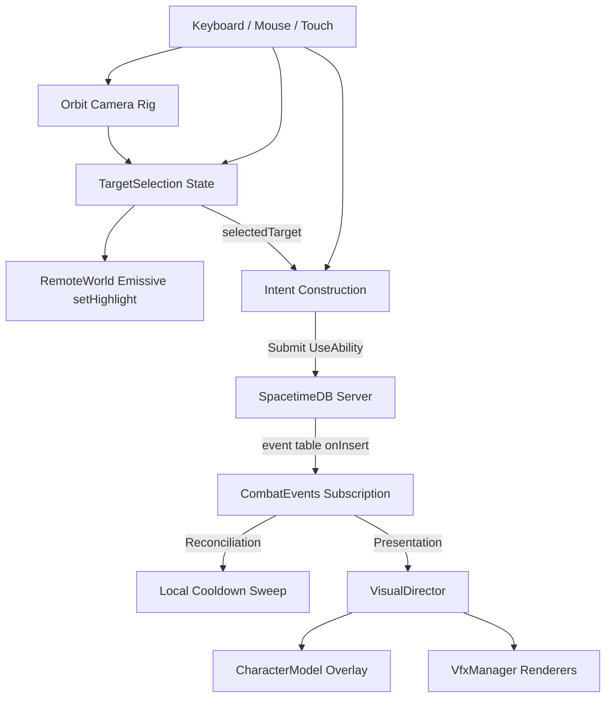

# Abilities, Aiming & Targeting

## Purpose & Role

This page details the implementation of client-side targeting, aiming profiles, and ability cooldown systems in the Web Client. The web client adheres to the authoritative game protocol defined by the server but implements local controllers, selection state, and visual feedback for interactive responsiveness.



---

## 1. Selection State Machine

`src/abilities/selection.ts` contains the `TargetSelection` controller, which manages the hover and selection state for remote entities.

### State Types
- **Hover Target (`bigint | undefined`)**: The entity the user is currently mousing over or which has been selected as the closest candidate on mobile tap/soft-targeting.
- **Selected Target (`bigint | undefined`)**: The actively locked/selected target (e.g. via left-click or Tab cycling).

### AOI Reconcile & Pruning
Because SpacetimeDB utilizes an Area of Interest (AOI) boundary, entities may be despawned or leave the client's visible range. 
- On every snapshot, the scene gathers all live IDs from `snapshot.remoteTransforms`.
- The `TargetSelection.reconcile(liveIds)` method is called to immediately clear hover or selection references to any entity that has left the AOI, preventing stale pointer actions or ghostly highlighting.

### Emissive Highlights
Visual selection status is propagated on every frame in the `src/render/scene.ts`
animation loop from the `TargetSelection` state to `RemoteWorld` via
`setHighlight(selected, hover)`.
- **Selected Target**: Amber emissive highlight `(0.8, 0.4, 0.0)`
- **Hover Target**: Blue emissive highlight `(0.1, 0.3, 0.8)`
- Cleared/restored when active references change.

---

## 2. Tab Targeting (Candidacy Sorting)

Pressing `Tab` triggers selection cycling via `cycleTabTarget()`. Rather than cycling raw entities in order of arrival, the web client employs a screen-space-first distance heuristic to target what the player is looking at:

1. **Self exclusion**: The controller filters out the player's own `ownEntityId` to prevent self-targeting.
2. **On-screen projection**: Entity coordinates are projected to Normalized Device Coordinates (NDC) using the active `THREE.Camera`.
3. **Primary bucket (On-screen)**: Entities currently within the camera frustum are prioritized. They are sorted by:
   - **Distance from center in screen-space**: $NDC_{distance} = \sqrt{ndcX^2 + ndcY^2}$. This prioritizes targets positioned nearest to the crosshair or center of the camera look-at vector.
4. **Secondary bucket (Off-screen)**: Off-screen entities are sorted purely by world-space distance from the camera.
5. **ID fallback**: Same-distance values fall back to sorting by `entityId` to maintain deterministic cycling.

---

## 3. Targeting Modes & Intent Payloads

Targeting behavior during cast triggers is determined by the ability's `targetingMode` catalog configuration:

### `entity_target`
Requires a target before casting. 
- Uses `selectedTarget?: bigint` from the active selection.
- If no target is selected, returns `AbilityTarget.None` accompanied by a target hint.
- Rejects casting with `missing_target` if targeting rules require an active object.
- Automatically prevents the player from targeting themselves.

### `raycast_strict`
- Ignores hover and selection entirely.
- Constructs direction-only vector arrays (`AbilityTarget.Direction`) using player orientation and camera look Vec3 vectors.

### `ground_target`
- Displays a visual click-to-place reticle projected on static collision meshes.
- Fires a `submitAbilitySlot` using the current pointer ray projection coordinate when left-clicking during selection mode.

### Camera And Pointer Modalities

`src/input/cameraRig.ts` owns orbit-camera math and camera-relative movement.
When the desktop mouse is free, pointer position drives hover, selection, and
ground-target placement. When pointer lock is captured through `Alt`, the mouse
rotates camera yaw/pitch and ability aim falls back to the center ray. Touch
uses the same center-ray default while a dedicated look stick rotates the camera;
the scene canvas remains available for selection, interact, and ground-target
taps. The action bar now tracks focused and armed skill slots separately so
tap-to-shoot, drag-release free aim, and future confirm-button/lock-on flows can
coexist without overloading target selection. `KeyC` detaches or reattaches the
follow anchor; detached camera is still presentation/input state and does not
create gameplay authority. Held `Shift` uses the same current aim/camera
direction to submit `Block` intents with a horizontal `look_dir`, so block facing
follows the same mental model as direction and aim-assist abilities.

On mobile devices and coarse pointers (detected via `matchMedia('(pointer: coarse)')`), exact pointer hovering is unavailable.
- The client widens the soft-target selection query radius from a fine pointer's collision width to **1.4 meters**.
- Soft targeting operates purely as feedback and never alters the direct aim vector itself, maintaining precise aiming consistency.

---

## 4. Cooldown System (Authority/Prediction Hybrid)

Ability cooldown UI elements are updated dynamically via a blend of local optimistic simulation and server-emitted transaction logs:

1. **Press Kickoff (`recordLocalCooldown`)**: When the player presses an ability key, the UI immediately displays an optimistic cooldown sweep based on the static `cooldownTicks` configured in the client catalog.
   - ***Anti-reset guard***: To prevent spamming/double-pressing from restarting/refreshing an active sweep before the server transaction logs commit, `recordLocalCooldown` immediately exits if there is a running cooldown active for that ability.
2. **Authoritative Cast Event (`CastStart`)**: The server emits a transient `combat_event` containing `effective_cooldown_ticks`. The client's cursor reconciliation loop captures this and overwrites the local predicted cooldown. This guarantees that **Cooldown Reduction (CDR)** and server-side state-modifications are represented immediately.
3. **Cancel on Death (`AbilityCancelled`)**: If the player dies, the server emits `AbilityCancelled` with reason `Death`. The local cooldown reconciliation loop intercepts this and immediately deletes any active local cooldowns and active charge timers.

---

## 5. Skill Presentation & VFX

The web client is presentation-only for skills. It derives timing and shapes
from generated ability metadata and uses server event payloads only when the
worker has resolved data the browser cannot infer, such as projectile
origin/direction/range or exact hazard world position.

### Generated Presentation Metadata

`cargo xtask dev web-contract --skip-schema` exports `abilities.json` from
`data/abilities.ron`. The browser normalizes this in `src/abilities/catalog.ts`.
Besides targeting and cooldown fields, the catalog exposes presentation-safe
timeline facts:

- `timelineDurationTicks`
- `hitboxSpawnTick`
- `damageFrameTick`
- `hitboxRemoveTick`
- `lingerTicks`
- `damageIntervalTicks`
- `previewShape`
- `offset`
- `projectileSpeed` / `maxRange`

These fields drive visual duration and placement hints. They are not gameplay
authority; damage, hit resolution, cooldown truth, target validation, and
contact outcomes remain server-owned.

### Visual Profiles

`src/render/visualProfiles.ts` owns art choices only. Profiles map ability ids
or targeting categories to:

- preferred character animation clip names
- fallback clip keywords such as `attack`
- minimum readable overlay duration
- VFX color/style categories

Missing custom clips degrade gracefully through the fallback keyword list. This
allows a skill to use a custom cast animation, the default spider `Attack`, VFX
only, or no character animation at all without changing gameplay metadata.

### VisualDirector

`src/render/visualDirector.ts` is the single combat-event presentation router.
`scene.ts` still owns input, cooldown reconciliation, selection, and local
prediction, but skill presentation is delegated to the director.

Event routing follows the Bevy presentation client model:

| Event | Web presentation |
|---|---|
| `CastStart` | Cast/cooldown reconciliation plus profile-driven character overlay. It may spawn inferred caster-attached previews such as Flame Aura. |
| `ProjectileLaunched` | Server-authoritative projectile VFX from origin, direction, speed, and max range. |
| `HazardSpawned` | Fire Patch / Lava Pool / boss hazards at exact server-resolved world position and radius. |
| `ContactHitboxSpawned` | Contact / secondary hitbox burst VFX. |
| `SkillObjectRemoved` | Removes projectile or hazard visuals by execution id. |
| `AbilityCancelled` | Cancels local or remote character overlays. |
| `Teleported` | Teleport start/end ring VFX. |
| `Damage` / `Healed` | Spawns DOM floating combat text through `FloatingOverlayLayer`. |

### Floating Overlay Layer

`src/render/floatingOverlay.ts` owns short-lived screen-space text that is
anchored to world positions but rendered as DOM. Damage and healing numbers use
this path instead of `VfxManager` because text overlays need crisp font
rendering, layout control, lifetime/easing, and future stacking rules more than
they need mesh materials or post-processing.

The layer stores world positions, projects them through the active camera every
frame, drifts/fades the DOM nodes, and removes them after their lifetime. Future
chat bubbles, nameplates, interaction labels, and boss callouts should reuse
this projection layer or a sibling overlay layer rather than becoming world VFX.

### VFX Renderer Modules

`src/render/vfx.ts` is a facade. Reusable visual construction lives in small
renderer modules under `src/render/vfx/`:

- `projectile.ts` — travelling projectile visuals, including range-bounded despawn.
- `hazard.ts` — ground hazard torus/disc visuals with periodic pulse support.
- `attached.ts` — caster-attached capsule sweeps and aura spheres.
- `burst.ts` — contact hitboxes and impact bursts.
- `teleport.ts` — start/end teleport rings.
- `types.ts` — shared active-effect and disposal helpers.

This keeps future shader and particle work localized to the relevant renderer
instead of expanding the scene loop or `VfxManager` into a monolith.

### Prediction Boundary

The browser may predict local character animation and local reticle/placement
feedback for responsiveness. Authoritative-looking world skill objects are
driven by server lifecycle events so the caster and remote observers see the
same Fireball, Fire Patch, Lava Pool, contact bursts, and removals.

---

## 6. Architectural Findings & Inconsistency Analysis

### Vite Dependency Cache Stale state (CRITICAL)
- **Symptom**: Runtime crashes during player cast or server connection with database reading errors (e.g. `readU64 Uncaught (in promise)`).
- **Cause**: If SpacetimeDB table schemas change or combat event algebraic types are regenerated on the server, the client binding `types.ts` is overwritten. However, because Vite pre-bundles package dependencies (specifically `@dive/client-contract`), it caches those older modules inside `apps/web/node_modules/.vite`. 
- **Action**: Run `npm run build` or delete `apps/web/node_modules/.vite` to force Vite to pre-bundle the refreshed types.

### Cancellation Policy Scope
- `AbilityCancelled` always cancels profile-driven character overlays through
  `VisualDirector`.
- Local cooldown refunds are intentionally policy-limited: `Death` clears the
  local cooldown entry, while `HardCC` and reserved cancel reasons do not imply
  a refund by themselves. This matches the ability lifecycle contract: clients
  clear speculative cast/charge UI on cancel, but reconcile cooldown truth from
  `CastStart` / `CooldownReady` rather than guessing refund semantics.

### Optional Snapshot Event Protection
- **Symptom**: Under test harnesses or mock environments, updating or receiving snapshots without any event elements (e.g., matching older schemas) fails with `TypeError: Cannot read properties of undefined (reading 'filter')`.
- **Mitigation**: Guard clauses are added in `reconcileLocalCooldownsFromSnapshot` to verify that `snapshot.combatEvents` is non-null and possesses array functions before running cursors:
  ```typescript
  const events = snapshot.combatEvents;
  if (!events || events.length === 0) {
    return;
  }
  ```
