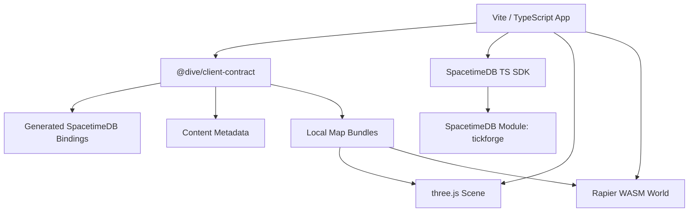

# Dive Web Architecture Overview

## What This Project Does

`apps/web` is the browser showcase client for Dive. It presents the same server-authoritative world as the native clients, but uses a web-native stack: Vite, TypeScript, three.js, Rapier WASM, and the official SpacetimeDB TypeScript SDK.

The web app now lives inside the Rust repository so client and server development share the same checkout. The boundary is still explicit: Rust crates remain the source of truth for schema, reducers, content, and authoritative simulation, while `apps/web` owns browser runtime code, rendering, diagnostics, input buffering, and visual validation.

## System Architecture

The app starts by validating the generated contract package, loading the startup
map bundle, building three.js debug geometry, and constructing static Rapier
colliders. Runtime dungeon bundles use the same path when an owned player enters
an instance. Heightfields are converted to browser TriMesh data from the
contract's Parry-style column-major samples so rendering and local Rapier
colliders do not drift.

It also wires browser keyboard/touch input into the generated intent queue,
drives an owned Rapier kinematic body with local movement prediction and server
reconciliation, and mounts DOM HUD surfaces for action buttons, diagnostics, and
loot. The SpacetimeDB connection can connect to `tickforge`, persist the
identity token, subscribe to AOI and loot views, auto-spawn the player, and call
allowed reducers for the gameplay loop.

## Modules at a Glance

`src/contract.ts` is the browser-facing contract gate. It imports the generated package manifest, content metadata, lookup data, and browser policy. It validates schema/content hash expectations supplied through Vite env vars and exports the generated subscription/reducer policy.

`src/stdb/connection.ts` owns the SpacetimeDB client shell. It builds the generated `DbConnection`, stores the auth token in `localStorage`, subscribes to the generated always-on AOI query set, calls `spawnPlayer` when needed, and publishes a compact diagnostic snapshot.

`src/world/content.ts` owns generated map-bundle lookup and validation. It resolves the startup layer bundle, dungeon bundles, collider format version, and content-hash consistency.

`src/world/physics.ts` owns Rapier initialization and static collider construction. It supports cuboid/cylinder directly, converts heightfields through `src/world/heightfield.ts`, validates TriMesh payloads, and falls back to a tiny fixed filler collider when malformed static data would otherwise crash browser physics.

`src/world/characterController.ts` owns the browser Rapier KCC wrapper. It derives capsule/KCC constants from `physics-prediction.json`, filters movement against static map colliders, and repairs small grounded-floor false negatives with a downward surface probe.

`src/net/inputQueue.ts` owns client intent sequencing. It mirrors the native client policy: monotonic `sequence_id`, capacity-12 pending ring, 75 ms resend age, 20 Hz resend cadence, ack pruning from `client_sequence`, and reducer-error classification.

`src/input/cameraRig.ts` owns the browser orbit-follow camera math: yaw/pitch/distance clamps, follow vs detached target anchoring, and camera-relative movement-vector rotation. `src/render/scene.ts` owns browser capture/touch wiring around that rig.

`src/ui/runtime.ts` owns the DOM UI shell. It provides layer roots for the scene,
HUD, action bar, panels, chat/text mode, and modals; applies local UI
preferences from `dive.uiPreferences.v1`; and publishes the input mode consumed
by scene input.

`src/ui/lootHud.ts` owns the browser loot marker/panel. It subscribes to
`loot_pile`, `loot_pile_item`, and `player_inventory`, filters same-layer
eligible piles with unclaimed rows, calls `claimLoot`, and treats inventory row
insertion plus pile/item deletion as the success feedback.

`src/abilities/` holds targeting and cursor systems, including `selection.ts` (manages the `TargetSelection` hover/select state machine and screen-space/world Tab cycling logic) and `intent.ts` (builds target-aware action payloads).

`src/render/scene.ts` owns the current playable browser scene. It renders
generated bundle colliders as debug geometry, builds the matching Rapier static
world, drives owned-player local KCC movement, resolves `E`/interact actions,
updates camera/selection/targeting surfaces, and exposes deterministic test
hooks for Playwright.

## Key Flows

- **Startup contract validation** loads `@dive/client-contract`, verifies optional expected schema/content hashes, and stops with a clear mismatch error if the generated artifact is stale.
- **Map loading** resolves layer `0` or the owned instance dungeon from the generated bundle catalog, validates the content hash and collider format, builds Rapier colliders, and renders debug meshes from the same collider data.
- **Connection startup** creates a SpacetimeDB connection, persists the identity token by URI/module, subscribes to AOI views, and calls `spawnPlayer` only when no owned `client_sequence` row is visible.
- **UI runtime startup** mounts the shell layer stack, loads local UI preferences, and exposes `inputMode` so panels, modals, and text entry suspend gameplay input consistently.
- **Input sequencing** turns local actions into ordered pending entries, sends single reducer calls, resends stale pending entries as a batch, and treats only stale-sequence errors as implicit acks. Movement is camera-relative. `Space` jumps, `Shift` holds block, `X` swaps weapon set, and `E` resolves selected entity, hovered entity, then nearest eligible loot with a free inventory slot.
- **Camera control** uses a third-person orbit follow camera. Desktop `Alt` toggles pointer-lock camera capture, touch uses a dedicated right-side look stick, mouse-free mode keeps hover/selection/ground aim, and `KeyC` freezes or reattaches the follow anchor for detached look-around.
- **Loot claim UX** renders eligible same-layer loot, calls the existing `claimLoot` reducer, surfaces reducer rejection text, and waits for subscription changes to show success.
- **Local prediction** uses generated physics metadata plus static map colliders for wall contact, dungeon floors, terrain heightfields, pending-input replay, and ground/aim queries.
- **Visual validation** uses Playwright to verify that the generated contract loads, startup/dungeon bundles are present, Rapier is ready, the WebGL canvas is nonblank, loot panels fit, and KCC movement keeps making progress on the authored training dungeon.

## Authority Boundary

The browser Rapier world is a responsiveness and presentation layer. It is not authoritative. Persistent state comes from SpacetimeDB subscriptions, and gameplay reducers are wrapped through the generated contract.

Browser code must not subscribe to raw entity tables or call privileged/admin reducers. The generated `browser-policy.json` is the source of truth for this boundary, and the static test fails if web source code violates it.
